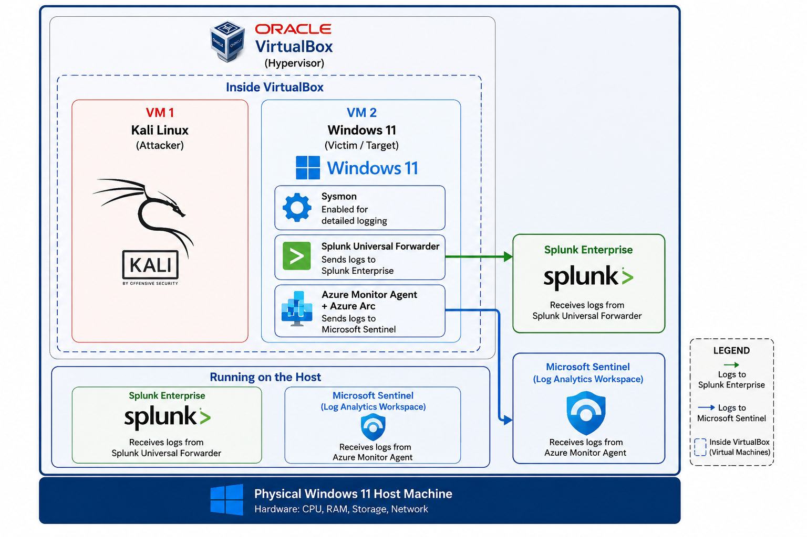

This lab demonstrates the setup of a basic Security Operations Center (SOC) environment. I configured a Windows 11 virtual machine with Sysmon for detailed logging, forwarded the logs to both Splunk Enterprise and Microsoft Sentinel, and executed a reverse shell from a Kali Linux attacker machine to imitate malicious activities.

The main goal was to understand how endpoint logs are collected and analyzed in real SIEM tools. This lab helped me learn the practical workflow of log collection, analysis, and mapping attacker behaviour to MITRE ATT&CK tactics.

The diagram below shows our SOC lab setup:

SOC Lab Architecture

